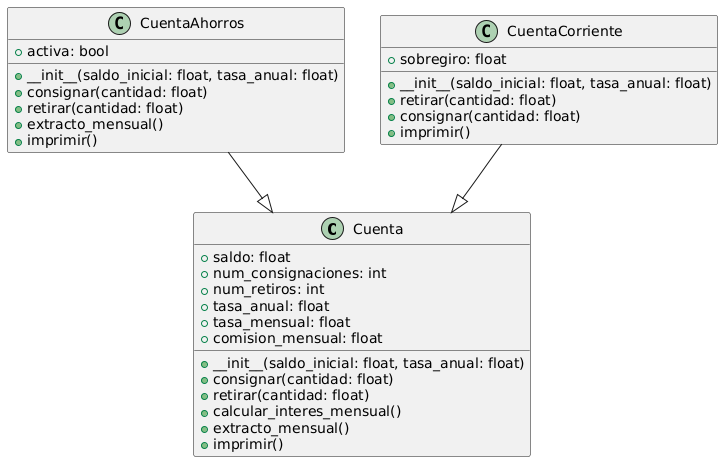
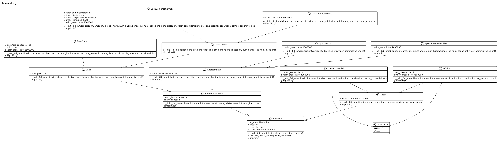
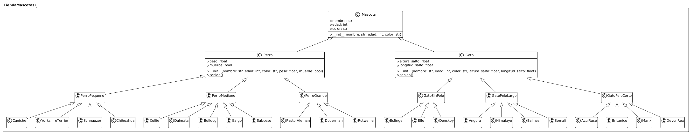
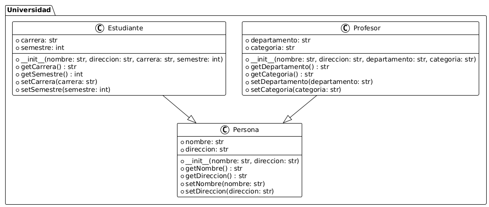
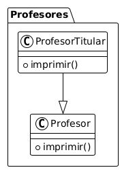

# 📘 Tarea 3 de Programación Orientada a Objetos

El archivo adjunto contiene los 5 ejercicios que se debían realizar.

---

## 🧠 Contenido

En cada uno de las carpetas se encuentran cada uno de los 5 ejercicios con su respectivo diagrama de clases. Los ejercicios que requerían la definición de paquetes se hicieron utilizando el estilo de programación de paquetes en python: Un archivo principal  [`main.py`](./) y varias subcarpetas que contienen las diferentes clases.

---

## 🚀 Nombre
Alejandro Valencia Ossa

---

##  📷 Diagramas de clase

## Ejercicio 1

---
## Ejercicio 2

---
## Ejercicio 3 
(se omiten los constructores de las especies debido al gran tamaño de la imagen)

---
## Ejercicio 4

---
## Ejercicio 5

